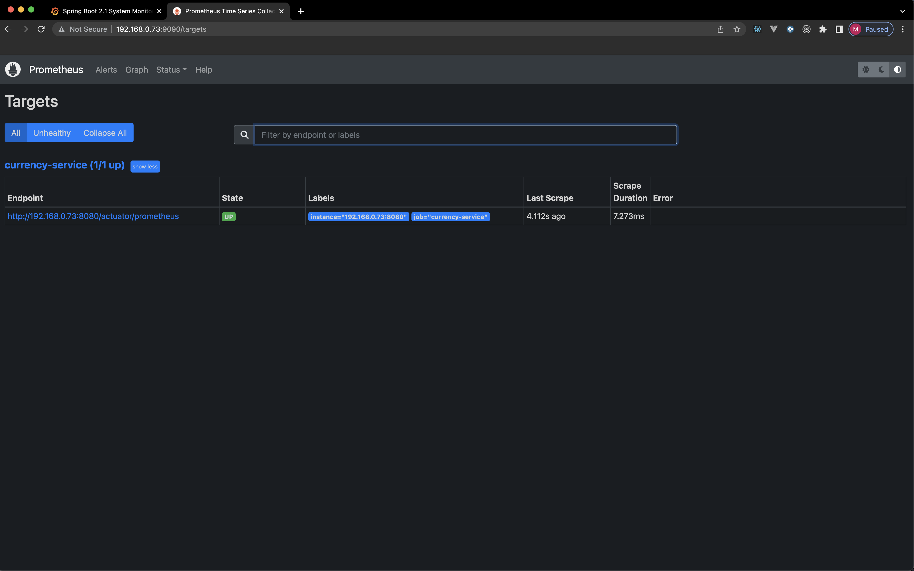
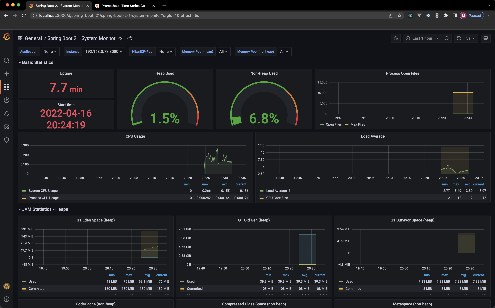

## Getting Started

1. `docker-compose -f currency-compose.yml up`
2. Start Spring Boot Application

## Swagger

* `http://localhost:8080/swagger-ui/index.html`

## Actuator

* `http://localhost:8080/actuator` - prettier with Postman

## Prometheus

* `http://localhost:9090/targets`

## Grafana

1. `http://localhost:3000/login`
   1. 1.Email/Username: admin
   2. Password: password
2. Add your first data source
3. Prometheus
4. Add URL - http://192.168.0.73:9090/ (TODO generic URL)
5. Save & test
6. Explore
7. To import a dashboard, in Grafana click the Dashboard icon on the left menu, select the Manage option, and click the Import button.
   1. Import Via grafana.com this https://grafana.com/grafana/dashboards/11378
8. Click Import

