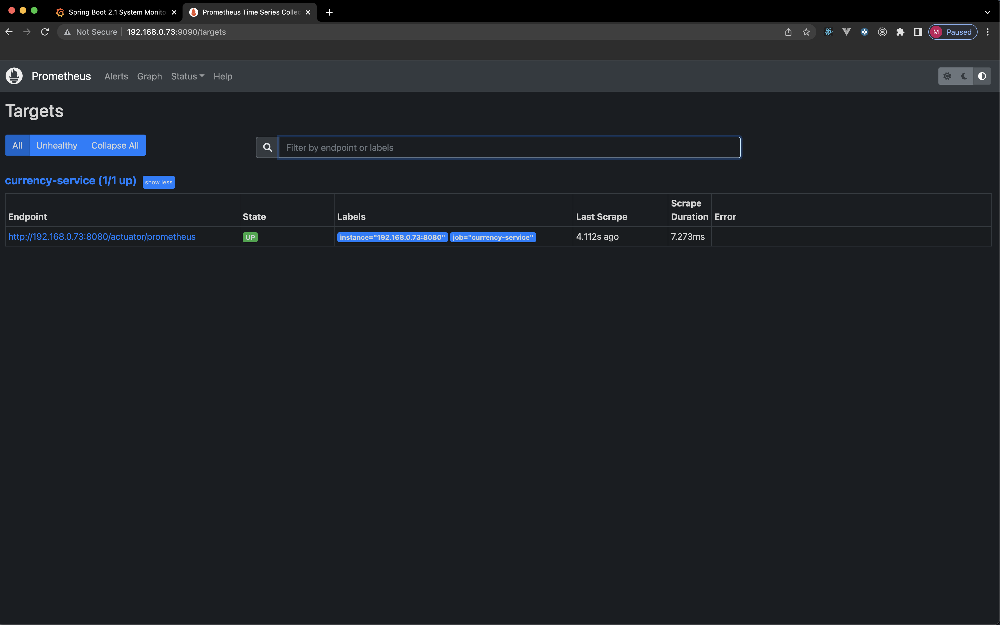
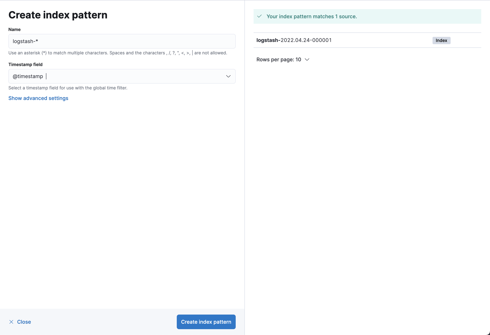

# Overview

## Spring Eureka

* http://localhost:8070/

## Prometheus

* http://localhost:9090/targets

## Grafana

1. http://localhost:3000/login
    1. 1.Email/Username: admin
    2. Password: password
2. Add your first data source
3. Prometheus
4. Add URL - http://192.168.0.73:9090/ (TODO generic URL)
5. Save & test
6. Explore
7. To import a dashboard, in Grafana click the Dashboard icon on the left menu, select the Manage option, and click the
   Import button.
    1. Import Via grafana.com this https://grafana.com/grafana/dashboards/11378
8. Click Import

## RabbitMQ

1. http://localhost:15672/
    1. Username: guest
    2. Password: guest

## Elasticsearch/Kibana/Logstash - ELK

1. http://localhost:5601/
2. Explore on my own
3. Open on the left the Dashboard
    1. Analytics -> Discover
4. Create Index Pattern
5. Enter
    1. `logstash-*`
    2. @timestamp
    3. Create index pattern see below

6. Go again to Analytics -> Discover

## Zipkin

* http://localhost:9411/zipkin/

